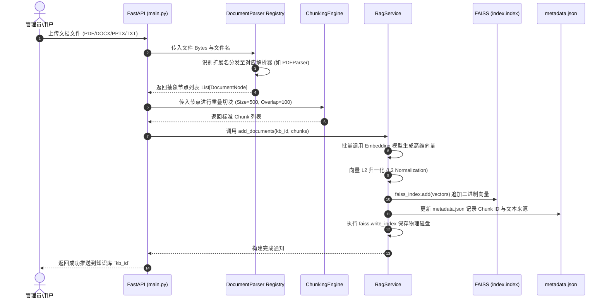
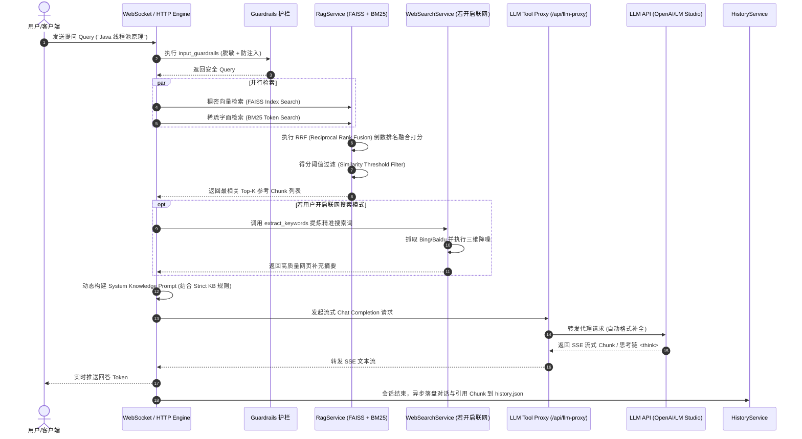

# 00_系统总体架构与工作流程

本文档为 **AI 知识库 / RAG 项目** 的系统级技术架构与端到端工作流程（Workflow）说明文档。

---

## 📁 模块中文文档索引

| 序号 | 模块中文文档 | 对应核心代码/服务 | 核心功能与工作流程概述 |
| :--- | :--- | :--- | :--- |
| **00** | [00_系统总体架构与工作流程.md](file:///Users/xiuxiuxiu/Documents/rag/docs/00_系统总体架构与工作流程.md) | `main.py`, `start.sh` | 系统整体架构、持久化目录布局、全景数据流与端到端 Workflow |
| **01** | [01_大模型控制与代理策略.md](file:///Users/xiuxiuxiu/Documents/rag/docs/01_大模型控制与代理策略.md) | `services/llm_service.py`, `main.py` | LLM 交互控制、OpenAI/LocalAPI 协议适配、Tool Call 格式修补代理工作流 |
| **02** | [02_向量数据库与混合检索.md](file:///Users/xiuxiuxiu/Documents/rag/docs/02_向量数据库与混合检索.md) | `services/rag_service.py` | FAISS 向量落盘、Dense+Sparse (FAISS + BM25) 混合检索与 RRF 融合打分流程 |
| **03** | [03_文档解析与重叠切块.md](file:///Users/xiuxiuxiu/Documents/rag/docs/03_文档解析与重叠切块.md) | `services/document_parser.py` | 多格式文档 (PDF/Word/PPT/TXT) 解析、节点树抽象与 Sliding Window 重叠切块流程 |
| **04** | [04_实时联网搜索与质量降噪.md](file:///Users/xiuxiuxiu/Documents/rag/docs/04_实时联网搜索与质量降噪.md) | `services/search_service.py` | LLM 搜索词提炼、Bing/Baidu 多引擎 Failover 抓取与三维领域强降噪流程 |
| **05** | [05_MCP协议与技能扩展.md](file:///Users/xiuxiuxiu/Documents/rag/docs/05_MCP协议与技能扩展.md) | `services/mcp_service.py`, `skills_service.py` | Standard MCP Client/Server 节点加载、JSON-RPC 2.0 交互与动态 Skills 调度流程 |
| **06** | [06_会话持久化与测试评估.md](file:///Users/xiuxiuxiu/Documents/rag/docs/06_会话持久化与测试评估.md) | `services/history_service.py`, `test_*.py` | 会话与引用 Chunk 存盘流程、系统通知与 RAG 检索效果自动化评估基准 |

---

## 🌐 全局架构拓扑图 (Global Architecture Topology)

```mermaid
flowchart TD
    subgraph Client ["前端 UI / 客户端 (HTTP REST & WebSocket)"]
        User[用户交互界面]
    end

    subgraph FastAPI ["FastAPI 后端核心 (main.py: 8000端口)"]
        WSHandler[WebSocket & HTTP 交互引擎]
        ConfigManager[配置与模式控制器]
    end

    subgraph RAGCore ["RAG & 向量检索引擎"]
        RagSvc[RagService]
        FAISS[(FAISS 向量数据库: data/vector_store/)]
        DocParser[DocumentParser 文档解析切块]
    end

    subgraph LLMModule ["LLM 与插件调用中心"]
        LLMSvc[LLMService (127.0.0.1:1234/v1)]
        LLMProxy[LLM Tool Proxy /api/llm-proxy]
        SearchSvc[WebSearchService 联网搜索]
        MCPModule[MCP Client/Server: data/mcp_servers.json]
        SkillsSvc[SkillsService: data/skills/]
    end

    subgraph StorageInfra ["持久化与基础设施"]
        HistorySvc[HistoryService: data/history.json]
        NotifSvc[NotificationService: data/notifications.json]
    end

    User -->|文本问答/管理| WSHandler
    WSHandler -->|查询问题| RagSvc
    RagSvc -->|读写索引与元数据| FAISS
    RagSvc -->|文档导入/切块| DocParser

    WSHandler -->|检索结果 + Prompt| LLMSvc
    LLMSvc <-->|工具调用格式强修复| LLMProxy
    WSHandler -->|开启联网搜索时| SearchSvc
    LLMProxy <-->|工具调用/协议扩展| MCPModule
    MCPModule <--> SkillsSvc

    WSHandler -->|记录会话与 Chunk 引用| HistorySvc
    WSHandler -->|触发状态变化提醒| NotifSvc

    LLMSvc -->|流式文本回复| WSHandler
    WSHandler -->|流式文本输出| User
```

---

## 🔄 核心系统端到端工作流程 (End-to-End Workflow Diagrams)

### 1. 文档导入与向量构建流程 (Ingestion Workflow)



---

### 2. 问答检索与 LLM 生成流程 (RAG Query Workflow)


