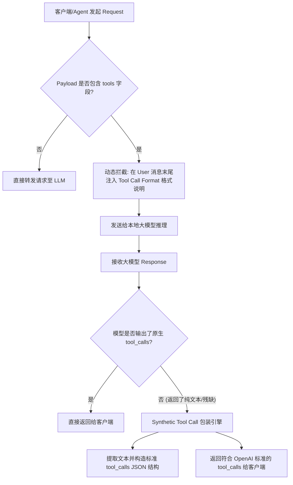

# 01_大模型控制与代理策略

本文档介绍大语言模型控制服务 `services/llm_service.py` 以及反向代理服务 `main.py::llm_proxy` 的架构设计、工作流程（Workflow）、提示词（Prompt）工程策略与 Tool-Call 自动修补机制。

---

## 🔄 LLM 工具调用代理与修补工作流程 (Tool-Call Proxy Workflow)

在对接开源小模型（如 7B/14B 量化模型）时，模型往往不支持 OpenAI 原生的 `tool_calls`。我们设计了反向代理层 `/api/llm-proxy`，其工作流程如下：



---

## 核心方法与实现细节

### 1. 动态参数与长上下文裁剪 (`prune_messages`)
为防止触发开源大模型的上下文溢出：
```python
def prune_messages(self, messages: List[Dict[str, str]], max_history: int = 6) -> List[Dict[str, str]]:
    if len(messages) <= max_history + 1:
        return messages
    system_msg = [m for m in messages if m.get("role") == "system"]
    history = [m for m in messages if m.get("role") != "system"]
    return system_msg + history[-max_history:]
```

### 2. 严谨模式 (Strict KB Mode) 与防幻觉 Prompt 流程
系统核心支持**严谨知识库模式**：
```python
def build_system_knowledge_prompt(contexts: List[str], strict_kb_mode: bool = False) -> str:
    context_text = "\n\n".join([f"【参考资料 {i+1}】:\n{c}" for i, c in enumerate(contexts)])
    
    if strict_kb_mode:
        return f"""你是一个极其严谨的 AI 知识库助手。请严格仅根据下述给出的【参考资料】回答用户问题。
要求：
1. 绝对不要使用你自身的先验知识或进行任何外部拓展与联想。
2. 如果【参考资料】中没有包含回答用户问题所需的明确答案，请直接回答：“抱歉，在当前选定的知识库中未找到与该问题相关的准确资料。”
3. 严禁编造或推测任何未提及的事实。

【参考资料】：
{context_text}"""
    else:
        return f"""你是一个智能 AI 知识库助手。请优先结合下述【参考资料】回答用户的问题：

【参考资料】：
{context_text}"""
```

---

## 🎯 面试高频问题

### Q1: 本地开源模型不支持 Function Calling 时，如何实现 Agent 插件驱动？
**回答参考**：
我们在后端设计了 `/api/llm-proxy` 工具调用代理层。
- **请求阶段**：拦截请求，在消息尾部注入 JSON Schema Format 强约束 Prompt。
- **响应阶段**：如开源模型返回纯文本，代理层会进行**自动结构化包裹 (Synthetic Tool Call Wrapping)**，将其构造成标准 OpenAI `tool_calls` 格式，对上层 Agent 业务透明。
