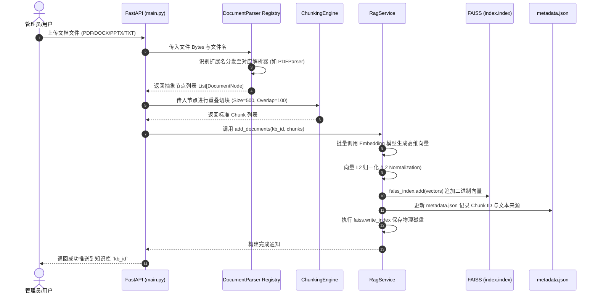
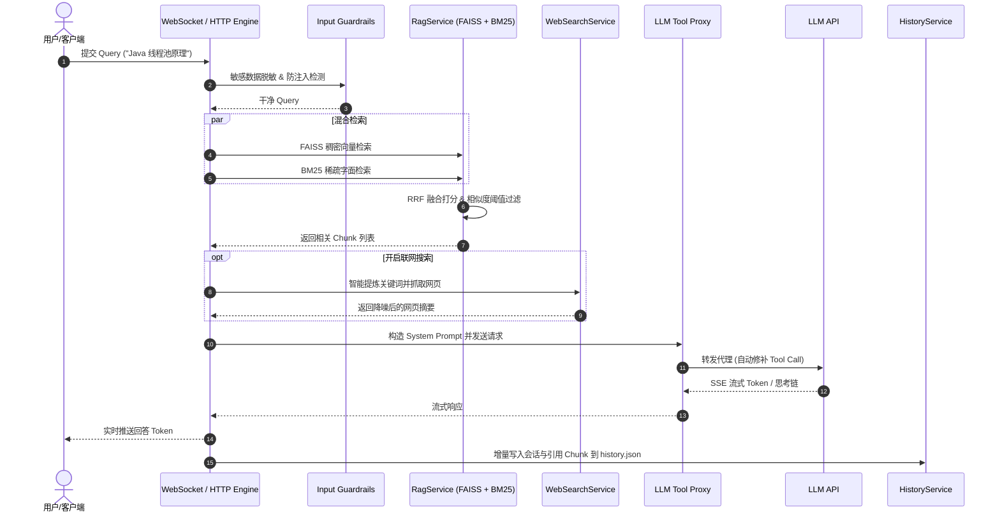
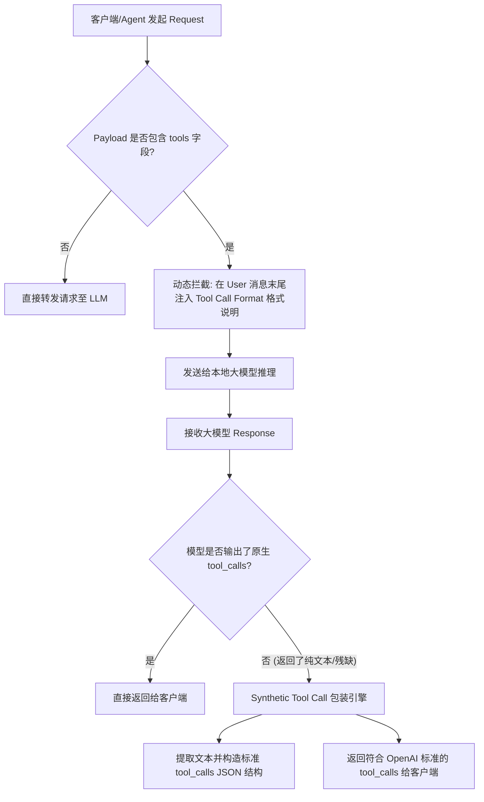

# RAG 智能知识库系统设计说明书 (System Design Document)

## 1. 项目概述与背景

本系统是一套高性能、高可用的 **RAG (Retrieval-Augmented Generation，检索增强生成) 智能知识库系统**。项目基于 **FastAPI + FAISS + BM25 + PyMuPDF + MCP 协议** 构建，旨在解决企业与个人在大模型问答场景下的以下关键痛点：

1. **幻觉与领域不精准 (Hallucination)**：通过私有知识库精准检索结合 Strict KB 严谨模式，解决大模型在专业领域乱编乱造的问题。
2. **专有名词与精准型号召回差 (Recall Bottleneck)**：采用 **Dense Vector + Sparse BM25 混合检索** 与 **RRF 倒数排名融合**，提升专有名词、编号与代码类名的召回率。
3. **本地开源模型 Agent 能力缺陷**：设计 **/api/llm-proxy 反向代理**，实现请求端 Prompt 诱导与响应端 Synthetic Tool Call 自动修补，使开源小模型无缝具备 Tool Calling / Function Calling 能力。
4. **多源前沿能力拓展**：集成多搜索引擎 Failure-over 联网搜索与 **Model Context Protocol (MCP)** 标准扩展协议，赋予 AI 跨端调取能力。

---

## 2. 总体架构与技术选型

### 2.1 全局架构拓扑图 (System Architecture Diagram)

```mermaid
flowchart TD
    subgraph ClientLayer ["客户端层 (Web / APP / WebSocket)"]
        Client[Web 交互前端]
    end

    subgraph APILayer ["API 与代理控制层 (FastAPI: 8000端口)"]
        WS[WebSocket & HTTP 路由引擎]
        LLMProxy[/api/llm-proxy 工具调用代理修补器]
    end

    subgraph CoreEngine ["核心业务引擎层"]
        subgraph ParserEngine ["1. 文档解析引擎 (services/document_parser.py)"]
            ParserReg[DocumentParserRegistry 工厂]
            ChunkEngine[ChunkingEngine 滑动窗口重叠切块]
        end

        subgraph RAGEngine ["2. RAG 检索与向量引擎 (services/rag_service.py)"]
            Guard[Input Guardrails 脱敏与防注入]
            FAISSIndex[FAISS 稠密向量索引]
            BM25Index[BM25 稀疏字面索引]
            RRFMerge[RRF 打分融合算法]
        end

        subgraph SearchEngine ["3. 联网搜索降噪引擎 (services/search_service.py)"]
            LLMExtract[LLM 关键词智能提炼]
            FailoverSearch[Bing/Baidu 多引擎 Failover 抓取]
            FilterRules[三维强降噪过滤器]
        end

        subgraph MCPEngine ["4. MCP 与 Skills 扩展引擎 (services/mcp_service.py)"]
            MCPClient[MCP Client (Stdio / SSE)]
            MCPServer[Native MCP Server (JSON-RPC 2.0)]
            SkillRouter[Skills 动态路由]
        end
    end

    subgraph PersistenceLayer ["数据持久化层 (rag/data/)"]
        VectorStore[(FAISS 向量落盘: data/vector_store/{kb_id}/)]
        MCPConfig[(MCP 配置: data/mcp_servers.json)]
        SkillsDir[(Skill 脚本: data/skills/)]
        HistoryDB[(会话历史: data/history.json)]
        NotifDB[(消息通知: data/notifications.json)]
    end

    Client -->|问答/流式交互| WS
    WS -->|上传解析| ParserReg
    ParserReg --> ChunkEngine
    ChunkEngine -->|写物理磁盘| VectorStore

    WS -->|查询| Guard
    Guard --> FAISSIndex & BM25Index
    FAISSIndex & BM25Index --> RRFMerge
    RRFMerge -->|读写向量/元数据| VectorStore

    WS -->|请求大模型| LLMProxy
    LLMProxy <-->|代理与工具拦截| MCPEngine
    MCPEngine <--> MCPConfig & SkillsDir

    WS -->|联网模式| SearchEngine
    WS -->|保存会话| HistoryDB
```

---

## 3. 端到端流程图集 (Complete Workflows)

### 3.1 文档导入与向量数据库构建流程图 (Ingestion Sequence Diagram)



---

### 3.2 问答检索与 LLM 生成全流程图 (Query Sequence Diagram)



---

### 3.3 Tool Call 反向代理拦截与修补流程图 (LLM Proxy Flowchart)



---

### 3.4 混合检索打分与阈值过滤流程图 (Hybrid Search & RRF Flowchart)

```mermaid
flowchart TD
    Query[用户原始 Query] --> Guard[input_guardrails 数据护栏: 脱敏 + 注入检测]
    Guard --> CleanedQuery[干净的 Query]
    
    CleanedQuery --> DenseBranch[稠密向量检索分支]
    CleanedQuery --> SparseBranch[稀疏 BM25 检索分支]
    
    subgraph DenseRetrieval [FAISS 稠密向量检索]
        DenseBranch --> Embedding[提取 Embedding 特征向量]
        Embedding --> L2Norm[L2 向量归一化]
        L2Norm --> FAISSSearch[FAISS Index 矩阵搜索]
        FAISSSearch --> DenseTopK[Vector Top-K 候选集 (Idx, CosineScore)]
    end
    
    subgraph SparseRetrieval [BM25 稀疏字面检索]
        SparseBranch --> Tokenize[中文分词 & 英文 Tokenize]
        Tokenize --> BM25Score[计算 TF-IDF & BM25 词频得分]
        BM25Score --> SparseTopK[BM25 Top-K 候选集 (Idx, BM25Score)]
    end
    
    DenseTopK --> RRF[RRF 倒数排名融合算法 Engine]
    SparseTopK --> RRF
    
    RRF --> RRFCalculate[计算 S(d) = Σ w / (k + rank)]
    RRFCalculate --> RankSort[按 RRF 得分降序重排]
    RankSort --> ThresholdFilter[相似度得分阈值过滤 Filter]
    ThresholdFilter --> MetaFetch[从 metadata.json 提取完整 Chunk 文本]
    MetaFetch --> FinalOutput[输出用于 Prompt 拼接的 Chunk 数组]
```

---

### 3.5 实时联网搜索与三维强降噪流程图 (Web Search Flowchart)

```mermaid
flowchart TD
    UserQuery[用户口语化提问] --> LLMExtract{开启 LLM 关键词提炼?}
    
    LLMExtract -- 是 --> LLMRewrite[调用 LLM 提炼精准搜索词: 剔除套话, 提取技术类名/原理]
    LLMExtract -- 否 --> RuleClean[规则兜底: 剥离 stop_prefixes 与 stop_suffixes 停用词]
    
    LLMRewrite --> Keywords[获得 1~3 个核心搜索词]
    RuleClean --> Keywords
    
    Keywords --> EngineSelect{搜索引擎选择 (Auto/Bing/Baidu)}
    
    EngineSelect --> BingFetch[抓取 Bing HTML 搜索结果页面]
    BingFetch --> CheckBing{抓取成功且未触发表单/验证码?}
    CheckBing -- 否 (Failover) --> BaiduFetch[自动降级抓取 Baidu HTML 结果]
    CheckBing -- 是 --> RawResults[获取原始网页结果列表]
    BaiduFetch --> RawResults
    
    RawResults --> Filter1[三维强降噪: 过滤 baike/zdic 字典类域名]
    Filter1 --> Filter2[过滤 oracle/java/redis 官网首页/下载入口]
    Filter2 --> Filter3[过滤单纯的 '环境配置/安装教程' 博客]
    
    Filter3 --> CleanHTML[HTML Tag 清洗与正文摘要截取]
    CleanHTML --> FormatMarkdown[格式化为 Markdown 联网上下文送入 LLM]
```

---

### 3.6 MCP 协议与 Skills 插件调度流程图 (MCP & Skills Flowchart)

```mermaid
flowchart TD
    LLM[LLM 输出了工具调用 Tool Call Request] --> Router{调度路由 Router}
    
    Router -- 内置系统能力 --> NativeMCPServer[MCPServer (提供 rag_search, web_search 接口)]
    Router -- 本地 Skills 插件 --> SkillSvc[SkillsService (加载 data/skills/{name}/)]
    Router -- 外部第三方节点 --> MCPClient[MCPClient (读取 data/mcp_servers.json)]
    
    subgraph SkillsExecution [Skills 插件执行流程]
        SkillSvc --> ReadManifest[校验 manifest.json 入参 Schema]
        ReadManifest --> RunScript[沙箱环境执行 script.py]
        RunScript --> SkillResult[返回插件执行结果 JSON]
    end
    
    subgraph ExternalMCP [外部 MCP 节点交互流程]
        MCPClient --> CheckType{节点模式 (Stdio / SSE)}
        CheckType -- Stdio --> PopenProc[subprocess.Popen 创建进程, 管道收发 JSON-RPC]
        CheckType -- SSE --> HTTPConn[HTTP SSE 长连接传递 JSON-RPC 2.0]
        PopenProc --> MCPResult[返回节点执行结果]
        HTTPConn --> MCPResult
    end
    
    NativeMCPServer --> Summarize[汇总 Tool Result 送回 LLM 拼接生成]
    SkillResult --> Summarize
    MCPResult --> Summarize
```

---

## 4. 数据持久化与物理存储规范

所有持久化数据均归一化存储在根目录 `data/` 下：

| 存储项 | 物理路径 | 存储格式 / 技术实现 | 作用与隔离策略 |
| :--- | :--- | :--- | :--- |
| **向量二进制索引** | `data/vector_store/{kb_id}/index.index` | FAISS Binary Index (`faiss.write_index`) | 存放向量矩阵与内积树，按 `kb_id` 沙箱隔离 |
| **Chunk 元数据** | `data/vector_store/{kb_id}/metadata.json` | JSON 文本结构 | 存文本段落、文件来源、页码，与向量 ID 保持 1-to-1 映射 |
| **MCP 节点配置** | `data/mcp_servers.json` | Standard JSON | 记录外部 Stdio/SSE 节点、命令参数与工具列表 |
| **Skills 插件包** | `data/skills/{skill_name}/` | `manifest.json` + `script.py` | 自定义本地工具 Schema 与 Python 运行脚本 |
| **会话历史与引用** | `data/history.json` | JSON 数组 | 保存对话上下文、RAG 引用 Chunk 与联网搜索结果 |
| **离线消息通知** | `data/notifications.json` | JSON 数组 | 保存系统通知、未读状态与提醒事项 |

---

## 5. 总结

本系统设计说明书包含了完整的数据流拓扑图、序列图与逻辑流程图（涵盖文档切块、向量落盘、混合检索、联网降噪、MCP 路由及 Tool-Call 代理修补），构成了高度严密的生产级系统设计规范。
